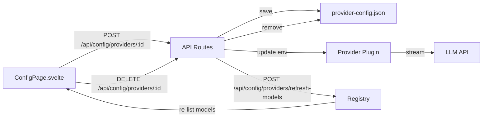
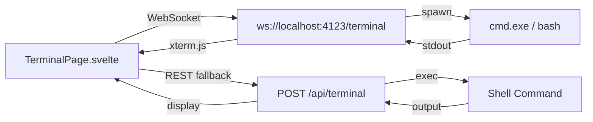
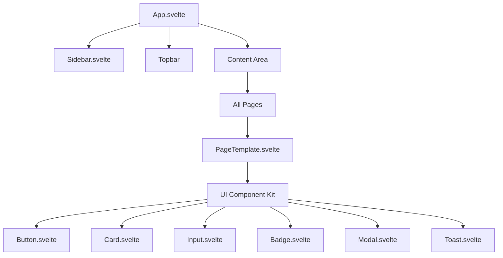

# NOVA v2 — Comprehensive Enhancement Plan

## Overview

This plan builds on the completed Phase 1 work (Plugin System, Channels, Background Agents) and addresses the user's new requirements: **Workers/Trading/Video analysis**, **Config/Settings with API key management**, **In-app Terminal**, and **UI Redesign**.

---

## Phase 1: Workers Enhancement

### Current State
- [`worker/manager.ts`](../nova/packages/core/src/worker/manager.ts) — In-memory `Map<string, WorkJob>`, no persistence, hardcoded to `deepseek/deepseek-chat` model
- [`WorkerPage.svelte`](../nova/packages/ui/src/routes/WorkerPage.svelte) — Basic UI with job creation form and job list
- API routes at [`routes.ts:327-337`](../nova/packages/core/src/api/routes.ts:327) — `GET /api/worker/jobs`, `GET /api/worker/jobs/:id`, `POST /api/worker/jobs`

### Issues
1. **No persistence** — Jobs lost on server restart
2. **Hardcoded model** — Always uses `deepseek/deepseek-chat`
3. **No cancellation** — Running jobs cannot be stopped
4. **No real-time progress** — UI must manually refresh
5. **No error recovery** — Failed tasks don't auto-retry

### Implementation Steps

#### 1.1 Add JSON persistence to Worker manager
- **File**: [`worker/manager.ts`](../nova/packages/core/src/worker/manager.ts)
- Add `WORKER_DATA_PATH = join(process.cwd(), "data", "worker-jobs.json")`
- Add `loadJobs()` — reads JSON file on startup
- Add `saveJobs()` — writes JSON file after each mutation
- Create `data/` directory if not exists

#### 1.2 Add cancellation support
- Add `AbortController` per job
- Add `cancelWorkJob(id)` function
- Add `POST /api/worker/jobs/:id/cancel` route in [`routes.ts`](../nova/packages/core/src/api/routes.ts)
- Pass `signal` to `executeTask()` → `resolved.provider.stream()`

#### 1.3 Add model selection
- Modify `createWorkJob()` to accept optional `modelRef` parameter
- Add model selector dropdown in [`WorkerPage.svelte`](../nova/packages/ui/src/routes/WorkerPage.svelte)
- Pass selected model from UI through API

#### 1.4 Add real-time progress via SSE
- Add `GET /api/worker/jobs/:id/stream` SSE endpoint
- Emit events through existing [`event-bus`](../nova/packages/core/src/event-bus/index.ts)
- Auto-refresh job list in UI via EventSource

#### 1.5 Add retry mechanism
- Add `maxRetries` field to `WorkJob` interface
- On task failure, retry up to 3 times with exponential backoff
- Track retry count in task metadata

---

## Phase 2: Trading Enhancement

### Current State
- [`trading/analyzer.ts`](../nova/packages/core/src/trading/analyzer.ts) — Simple Yahoo Finance stub returning `{ symbol, price, change, recommendation, reason }`
- [`TradingPage.svelte`](../nova/packages/ui/src/routes/TradingPage.svelte) — Rich UI expecting `summary`, `sentiment`, `signals[]`, `technical`, `fundamental` fields
- API route at [`routes.ts:406`](../nova/packages/core/src/api/routes.ts:406) — `GET /api/trading/:symbol`

### Issues
1. **Backend-UI mismatch** — UI expects rich data but backend only returns basic price/change
2. **No AI analysis** — No integration with Nova's LLM for market analysis
3. **No historical data** — Only current price, no trends or charts
4. **No portfolio/watchlist** — No persistence of tracked symbols

### Implementation Steps

#### 2.1 Enhance Analysis interface
- **File**: [`trading/analyzer.ts`](../nova/packages/core/src/trading/analyzer.ts)
- Extend `Analysis` interface to include: `summary`, `sentiment`, `signals[]`, `technical`, `fundamental`, `historicalData[]`
- Add Yahoo Finance historical data fetching (daily prices for last 30 days)

#### 2.2 Add AI-powered analysis
- After fetching raw data, call Nova's LLM (via `registry.resolveModel()`) to generate:
  - Natural language summary
  - Sentiment classification (bullish/bearish/neutral)
  - Technical signals (RSI, MACD, moving average crossovers)
  - Fundamental analysis summary
- Use a system prompt like: `"You are a financial analyst. Analyze the following stock data..."`

#### 2.3 Add portfolio/watchlist persistence
- Create [`trading/portfolio.ts`](../nova/packages/core/src/trading/portfolio.ts)
- JSON file-based persistence at `data/portfolio.json`
- Functions: `addToWatchlist(symbol)`, `removeFromWatchlist(symbol)`, `getWatchlist()`
- API routes: `GET /api/trading/watchlist`, `POST /api/trading/watchlist`, `DELETE /api/trading/watchlist/:symbol`

#### 2.4 Update TradingPage UI
- Add watchlist panel with quick-select chips
- Add historical data mini-chart (CSS-based sparkline)
- Add auto-refresh button

---

## Phase 3: Video Enhancement

### Current State
- [`video/pipeline.ts`](../nova/packages/core/src/video/pipeline.ts) — Full 5-step pipeline (story → audio → subtitles → images → assembly), in-memory `Map<string, VideoJob>`
- [`VideoPage.svelte`](../nova/packages/ui/src/routes/VideoPage.svelte) — 12-step wizard UI with auto-refreshing job list

### Issues
1. **No persistence** — Jobs lost on server restart
2. **No cancellation** — Running pipeline cannot be stopped
3. **No output file serving** — Video files not accessible via HTTP
4. **No model selection** — Hardcoded to `deepseek/deepseek-chat`

### Implementation Steps

#### 3.1 Add JSON persistence
- **File**: [`video/pipeline.ts`](../nova/packages/core/src/video/pipeline.ts)
- Add `VIDEO_DATA_PATH = join(process.cwd(), "data", "video-jobs.json")`
- Add `loadJobs()` / `saveJobs()` functions
- Save after each pipeline stage update

#### 3.2 Add cancellation support
- Add `cancelVideoJob(id)` function
- Add `POST /api/video/jobs/:id/cancel` route
- Pass `AbortSignal` through pipeline stages
- Clean up work directory on cancellation

#### 3.3 Add video file serving
- Add `GET /api/video/jobs/:id/download` route
- Stream video file from `video_output/` directory
- Add download button in UI

#### 3.4 Add model selection
- Pass `model` parameter through pipeline to story generation
- Add model selector in VideoPage wizard

---

## Phase 4: Config/Settings Overhaul — API Key Management

### Current State
- [`ConfigPage.svelte`](../nova/packages/ui/src/routes/ConfigPage.svelte) — Minimal page with Global Rules editor, hardcoded provider status display, disabled model selector
- [`../nova/.env`](../nova/.env) — Only `DEEPSEEK_API_KEY` set, others empty
- Each provider reads API key from `process.env[envVar]` (e.g., [`provider-deepseek/src/index.ts:25`](../nova/packages/provider-deepseek/src/index.ts:25), [`provider-openai/src/index.ts:11`](../nova/packages/provider-openai/src/index.ts:11))
- SDK type [`ProviderPlugin.auth`](../nova/packages/sdk/src/types.ts:24) defines `{ method, envVar }`

### Issues
1. **No UI for API key input** — Users must manually edit `.env` file
2. **No persistent config file** — `.env` is not managed by the app
3. **No "unbind" button** — Cannot disconnect a provider
4. **No provider status dashboard** — Current status is hardcoded HTML
5. **No model auto-refresh** — After adding API key, models don't reload
6. **No token limit configuration** — `max_tokens: 4096` is hardcoded in each provider

### Implementation Steps

#### 4.1 Create provider config persistence layer
- **New file**: [`config/provider-config.ts`](../nova/packages/core/src/config/provider-config.ts)
- JSON file at `data/provider-config.json`
- Interface:
```typescript
interface ProviderConfig {
  providerId: string;
  apiKey: string;
  baseUrl?: string;
  enabled: boolean;
  maxTokens?: number;
  thinkingLevel?: string;
}
```
- Functions: `loadProviderConfigs()`, `saveProviderConfig(config)`, `deleteProviderConfig(providerId)`, `getProviderConfig(providerId)`
- On startup, merge saved configs into `process.env` so existing providers pick them up

#### 4.2 Add API routes for provider config
- **File**: [`routes.ts`](../nova/packages/core/src/api/routes.ts)
- `GET /api/config/providers` — List all providers with their status (configured/missing)
- `POST /api/config/providers/:id` — Save API key for a provider
- `DELETE /api/config/providers/:id` — Remove API key (unbind)
- `POST /api/config/providers/:id/test` — Test connection with saved key
- `POST /api/config/providers/refresh-models` — Force model refresh

#### 4.3 Rebuild ConfigPage.svelte
- **File**: [`ConfigPage.svelte`](../nova/packages/ui/src/routes/ConfigPage.svelte)
- **Provider Cards Section**: For each registered provider, show:
  - Provider name + icon
  - Status badge (✅ Configured / ⚠️ Missing Key / 🔴 Error)
  - API key input field (password type) with "Save" button
  - "Unbind" button (when configured) — removes key
  - "Test Connection" button
  - Model count badge
- **Token Limits Section**:
  - Per-provider max tokens slider/input
  - Default thinking level selector
- **Model List Section**:
  - Auto-refresh after API key save
  - Search/filter models
  - Show model details (context window, cost, reasoning support)

#### 4.4 Add model refresh mechanism
- After saving API key, call `POST /api/config/providers/refresh-models`
- Backend re-registers the provider (or updates its auth)
- Returns updated model list
- UI updates the model selector and model grid

#### 4.5 Wire up token limits
- Pass `maxTokens` from config to provider stream calls
- Modify [`runner.ts`](../nova/packages/core/src/agent/runner.ts) to read token limits from config
- Add `maxTokens` parameter to [`StreamParams`](../nova/packages/sdk/src/types.ts:30)

---

## Phase 5: In-App System Terminal

### Current State
- [`gateway/terminal.ts`](../nova/packages/core/src/gateway/terminal.ts) — WebSocket-based PTY terminal using `ws` library, spawns `cmd.exe` on Windows
- [`gateway/routes-terminal.ts`](../nova/packages/core/src/gateway/routes-terminal.ts) — REST API `POST /api/terminal` for one-shot command execution
- [`tmux/tools.ts`](../nova/packages/core/src/tmux/tools.ts) — Tmux session management (create/list/kill/send/capture)
- API routes at [`routes.ts:532-556`](../nova/packages/core/src/api/routes.ts:532) — Tmux session management endpoints
- WebSocket endpoint at `ws://localhost:4123/terminal`

### Issues
1. **No UI component** — Terminal WebSocket exists but no frontend to connect to it
2. **No xterm.js integration** — Raw WebSocket, no terminal emulator in browser
3. **No session management UI** — Cannot create/switch/kill terminal sessions from UI
4. **No tmux UI** — Tmux tools exist but no frontend

### Implementation Steps

#### 5.1 Create TerminalPage.svelte
- **New file**: [`TerminalPage.svelte`](../nova/packages/ui/src/routes/TerminalPage.svelte)
- Full-screen terminal emulator using **xterm.js** (via npm package `@xterm/xterm`)
- Connect to `ws://localhost:4123/terminal` WebSocket
- Features:
  - Dark theme matching Nova's design
  - Resizable
  - Copy/paste support
  - Terminal title in tab
  - Multiple terminal tabs (optional, Phase 5.3)

#### 5.2 Add terminal to sidebar navigation
- **File**: [`Sidebar.svelte`](../nova/packages/ui/src/lib/components/Sidebar.svelte)
- Add `{ id: "terminal", icon: "💻", label: "Terminal" }` tab
- **File**: [`App.svelte`](../nova/packages/ui/src/App.svelte)
- Add `import TerminalPage from "./routes/TerminalPage.svelte";`
- Add route handler: `{:else if route === "terminal"} <TerminalPage />`

#### 5.3 Add terminal session management (optional enhancement)
- Use existing tmux API for session management
- Add session list sidebar within terminal page
- Add new session / kill session buttons
- Add session name input

#### 5.4 Add REST terminal fallback
- For environments where WebSocket is blocked
- Add terminal input field + output display using `POST /api/terminal`
- Auto-detect WebSocket availability

---

## Phase 6: UI Redesign

### Current State
- [`App.svelte`](../nova/packages/ui/src/App.svelte) — Simple dark/light theme, basic topbar with model badge and connection status
- [`Sidebar.svelte`](../nova/packages/ui/src/lib/components/Sidebar.svelte) — 11 navigation tabs, recent sessions list, models list
- All pages use consistent but basic styling (dark theme, indigo accent `#6366f1`)

### Design Goals
1. **Modern glassmorphism aesthetic** — Frosted glass cards, subtle gradients, layered depth
2. **Better information density** — Compact layouts, smarter use of space
3. **Animated transitions** — Smooth page transitions, micro-interactions
4. **Responsive sidebar** — Collapsible with smooth animation (already partially done)
5. **Unified component system** — Shared button, card, input, badge components

### Implementation Steps

#### 6.1 Create shared component library
- **New directory**: [`lib/components/ui/`](../nova/packages/ui/src/lib/components/ui/)
- Components:
  - `Button.svelte` — Variants: primary, secondary, ghost, danger; sizes: sm, md, lg
  - `Card.svelte` — With optional header, footer, hover effects
  - `Input.svelte` — With label, error state, icon slot
  - `Badge.svelte` — Variants: success, warning, error, info, neutral
  - `Modal.svelte` — With backdrop, close button, animation
  - `Select.svelte` — Styled dropdown
  - `Toggle.svelte` — Switch component
  - `Spinner.svelte` — Loading indicator
  - `Toast.svelte` — Notification component (already partially exists in App.svelte)

#### 6.2 Redesign App.svelte layout
- **File**: [`App.svelte`](../nova/packages/ui/src/App.svelte)
- Add glassmorphism effect to topbar (backdrop-filter: blur, semi-transparent background)
- Add page transition animations (fade + slide)
- Improve connection status indicator (pulsing dot with tooltip)
- Add keyboard shortcut hints (Ctrl+K for command palette, etc.)
- Move toast to dedicated component

#### 6.3 Redesign Sidebar
- **File**: [`Sidebar.svelte`](../nova/packages/ui/src/lib/components/Sidebar.svelte)
- Add section dividers between logical groups (Core, Tools, Media, System)
- Add search/filter for navigation items
- Add collapsible sub-menus (e.g., Tools → Worker, Trading, Terminal)
- Add notification badges for active items
- Improve recent sessions with preview text
- Add "New Chat" quick button at top

#### 6.4 Create unified page template
- **New file**: [`lib/components/PageTemplate.svelte`](../nova/packages/ui/src/lib/components/PageTemplate.svelte)
- Consistent page header with title, subtitle, actions
- Responsive padding
- Scroll container with custom scrollbar
- Loading state placeholder

#### 6.5 Apply redesign to all pages
- Update each page to use `PageTemplate`
- Apply glassmorphism cards
- Add consistent spacing and typography
- Add micro-interactions (hover effects, transitions)

#### 6.6 Add dark/light theme refinement
- Refine color palette:
  - Dark: `--bg: #0a0a12`, `--card: #12121e`, `--border: #1e1e30`, `--accent: #6366f1`
  - Light: `--bg: #f5f5fa`, `--card: #ffffff`, `--border: #e0e0ec`, `--accent: #6366f1`
- Add CSS custom properties for all common values
- Ensure all components respect theme

---

## Phase 7: Live Token Usage Display

### Current State
- [`StreamChunk`](../nova/packages/sdk/src/types.ts:39) includes `{ type: "usage"; input: number; output: number }` — providers emit usage data
- [`SessionEntry.usage`](../nova/packages/sdk/src/types.ts:133) stores `{ input, output, total, cost }`
- [`ChatPage.svelte`](../nova/packages/ui/src/routes/ChatPage.svelte) — No token display

### Implementation Steps

#### 7.1 Capture token usage in chat
- **File**: [`ChatPage.svelte`](../nova/packages/ui/src/routes/ChatPage.svelte)
- Listen for usage chunks in SSE stream
- Accumulate per-session token counts
- Display live counter in chat header or footer

#### 7.2 Add token usage badge
- Show in topbar: `🔤 1,234 / 5,678 (input/output)`
- Update in real-time as streaming progresses
- Show estimated cost based on model pricing

#### 7.3 Add session token breakdown
- **File**: [`SessionsPage.svelte`](../nova/packages/ui/src/routes/SessionsPage.svelte)
- Show per-session token usage in session list
- Add total usage summary across all sessions

---

## Phase 8: Memory & Reports Integration

### Current State
- [`memory/store.ts`](../nova/packages/core/src/memory/store.ts) — File-based memory store with `save()`, `search()`, `getAll()`, `delete()`
- [`agent/scheduler.ts`](../nova/packages/core/src/agent/scheduler.ts) — Already saves reports to memory on background agent completion
- [`MemoryPage.svelte`](../nova/packages/ui/src/routes/MemoryPage.svelte) — Basic memory viewer

### Implementation Steps

#### 8.1 Enhance MemoryPage UI
- Add search/filter functionality
- Add importance filter (low/medium/high)
- Add scope filter (user/project)
- Add memory detail view with full content
- Add delete confirmation

#### 8.2 Add memory to agent context
- **File**: [`agent/runner.ts`](../nova/packages/core/src/agent/runner.ts)
- Inject relevant memories into agent system prompt
- Use `memoryStore.search()` with agent's task as query
- Add configurable memory injection toggle

#### 8.3 Add report viewing
- In [`AgentsPage.svelte`](../nova/packages/ui/src/routes/AgentsPage.svelte), add "View Report" button for completed background jobs
- Show report content in a modal or side panel
- Link to memory entry

---

## Phase 9: Twitter/X Integration

### Current State
- No Twitter integration exists

### Implementation Steps

#### 9.1 Create Twitter channel plugin
- **New file**: [`channel-twitter/src/index.ts`](../nova/packages/channel-twitter/src/index.ts)
- Use Twitter API v2 for posting tweets and reading mentions
- Config fields: `apiKey`, `apiSecret`, `accessToken`, `accessSecret`
- Implement `ChannelPlugin` interface

#### 9.2 Add Twitter to channel manager
- Register in [`channel/manager.ts`](../nova/packages/core/src/channel/manager.ts)
- Add to channel definitions in UI

#### 9.3 Add Twitter agent skill
- **New file**: [`skill/twitter.ts`](../nova/packages/core/src/skill/twitter.ts)
- Allow agents to post tweets, search Twitter, read timelines
- Register as a tool

---

## Architecture Diagrams

### Provider Config Flow


### Terminal Architecture


### UI Component Architecture


---

## File Change Summary

| Phase | File | Action |
|-------|------|--------|
| 1.1 | `packages/core/src/worker/manager.ts` | Modify — add JSON persistence |
| 1.2 | `packages/core/src/api/routes.ts` | Modify — add cancel route |
| 1.3 | `packages/ui/src/routes/WorkerPage.svelte` | Modify — add model selector, cancel button |
| 1.4 | `packages/core/src/worker/manager.ts` | Modify — add SSE streaming |
| 2.1 | `packages/core/src/trading/analyzer.ts` | Modify — extend Analysis interface, add historical data |
| 2.2 | `packages/core/src/trading/analyzer.ts` | Modify — add AI-powered analysis via LLM |
| 2.3 | `packages/core/src/trading/portfolio.ts` | **New** — watchlist persistence |
| 2.4 | `packages/ui/src/routes/TradingPage.svelte` | Modify — add watchlist, sparkline |
| 3.1 | `packages/core/src/video/pipeline.ts` | Modify — add JSON persistence |
| 3.2 | `packages/core/src/video/pipeline.ts` | Modify — add cancellation |
| 3.3 | `packages/core/src/api/routes.ts` | Modify — add download route |
| 3.4 | `packages/ui/src/routes/VideoPage.svelte` | Modify — add model selector |
| 4.1 | `packages/core/src/config/provider-config.ts` | **New** — provider config persistence |
| 4.2 | `packages/core/src/api/routes.ts` | Modify — add provider config routes |
| 4.3 | `packages/ui/src/routes/ConfigPage.svelte` | **Rewrite** — full API key management UI |
| 4.4 | `packages/core/src/plugin/registry.ts` | Modify — add refresh mechanism |
| 4.5 | `packages/core/src/agent/runner.ts` | Modify — read token limits from config |
| 5.1 | `packages/ui/src/routes/TerminalPage.svelte` | **New** — xterm.js terminal |
| 5.2 | `packages/ui/src/App.svelte` | Modify — add terminal route |
| 5.2 | `packages/ui/src/lib/components/Sidebar.svelte` | Modify — add terminal tab |
| 6.1 | `packages/ui/src/lib/components/ui/*.svelte` | **New** — shared component library |
| 6.2 | `packages/ui/src/App.svelte` | Modify — glassmorphism, animations |
| 6.3 | `packages/ui/src/lib/components/Sidebar.svelte` | Modify — sections, search, sub-menus |
| 6.4 | `packages/ui/src/lib/components/PageTemplate.svelte` | **New** — unified page template |
| 6.5 | All page files | Modify — apply new design system |
| 7.1 | `packages/ui/src/routes/ChatPage.svelte` | Modify — live token counter |
| 7.2 | `packages/ui/src/App.svelte` | Modify — token usage badge in topbar |
| 8.1 | `packages/ui/src/routes/MemoryPage.svelte` | Modify — search, filter, detail view |
| 8.2 | `packages/core/src/agent/runner.ts` | Modify — memory injection |
| 9.1 | `packages/channel-twitter/src/index.ts` | **New** — Twitter channel plugin |
| 9.2 | `packages/core/src/channel/manager.ts` | Modify — register Twitter |
| 9.3 | `packages/core/src/skill/twitter.ts` | **New** — Twitter agent skill |

---

## Execution Order

The phases should be executed in this order due to dependencies:

1. **Phase 4** (Config/Settings) — Foundation for all API key management
2. **Phase 1** (Workers) — Independent enhancement
3. **Phase 2** (Trading) — Independent enhancement
4. **Phase 3** (Video) — Independent enhancement
5. **Phase 5** (Terminal) — Requires UI component library from Phase 6
6. **Phase 6** (UI Redesign) — Foundation for all UI improvements
7. **Phase 7** (Token Usage) — Requires Config from Phase 4
8. **Phase 8** (Memory) — Already partially done in scheduler
9. **Phase 9** (Twitter) — Independent, lowest priority
